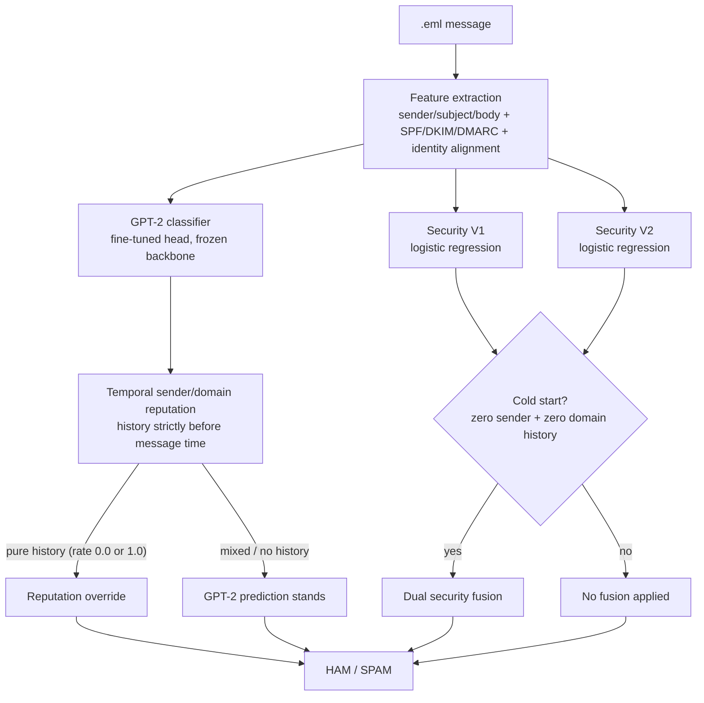

# Email Spam Detector

## Overview

This applied research project explores email spam and phishing classification with a multi-stage architecture. It combines message-content classification, time-aware sender and domain history, and security-derived signals:



The system is experimental and is not presented as a production email-security product.

## Quickstart

```bash
cd projects/email-spam-detector
uv venv --python 3.12
# Windows PowerShell: .venv\Scripts\Activate.ps1
# macOS/Linux:        source .venv/bin/activate
uv pip install -e ".[dev]"
pytest -m smoke
```

This installs the package and runs the offline smoke tests — synthetic
`.eml` fixtures exercising header-parsing logic only, see
[Testing](#testing). The full GPT-2 + Security V1/V2 + temporal-reputation
pipeline needs private checkpoints and data not included in this
repository; see [Installation](#installation) and [Data](#data) below for
what a fresh clone can and can't reproduce.

## Privacy

This project processes data that can be highly sensitive:

- Raw mailbox exports are private and are not distributed.
- `.eml` files may contain personal messages, addresses, headers, identifiers, and attachments.
- Row-level private predictions are not published.
- Security headers may contain identifying infrastructure metadata.
- Generated live-classification JSON may contain local paths and email metadata.
- Private datasets, checkpoints, trained models, and generated artifacts are intentionally excluded from Git where appropriate.

Do not commit private mailbox data or outputs derived from identifiable messages.

## GPT-2 Classifier

The primary content model is a PyTorch implementation of GPT-2 Small (124M configuration). It uses the GPT-2 vocabulary, 12 transformer blocks, a 768-dimensional embedding space, 12 attention heads, and a context length of 1,024 tokens.

Each model input combines the available sender, subject, and message body with explicit field labels. The implementation loads pretrained OpenAI GPT-2 weights, replaces the language-model head with a two-class HAM/SPAM head, and fine-tunes:

- the new classification head;
- the final transformer block; and
- the final layer normalization.

Other pretrained GPT-2 parameters remain frozen. Classification logits are selected at each message's real end-of-sequence position.

## Temporal Sender and Domain Reputation

The temporal layer supplements the GPT-2 prediction with historical evidence:

- Sender reputation uses the normalized exact sender address.
- Domain reputation uses the normalized sender domain.
- Only history strictly earlier than the target message timestamp is eligible.
- Mixed-format timestamps are parsed and normalized to UTC.
- Sender evidence has priority over domain evidence.
- The current live minimum-history count is one.
- An override requires a pure historical spam rate: `0.0` for HAM or `1.0` for SPAM. Mixed history falls back to GPT-2.
- Known shared-relay infrastructure is excluded from reputation overrides.
- Missing or invalid target dates fall back to GPT-2.

The live implementation has a temporal parity regression check against the corrected evaluation implementation. Its verified invariant is:

```text
Prediction mismatches: 0
Sender count mismatches: 0
Domain count mismatches: 0
Sender rate mismatches: 0
Domain rate mismatches: 0
```

This invariant should remain unchanged when modifying temporal code; reproducing it requires the private historical data that isn't distributed with this repository.

## Email Security Features

The security pipeline extracts authentication, alignment, and identity evidence from email headers. Implemented signals include:

- SPF, DKIM, and DMARC results;
- authentication-result and DKIM-signature availability;
- Return-Path and Reply-To availability;
- exact and organizational-domain alignment between From, Return-Path, Reply-To, and DKIM domains;
- display-name and sender-domain identity similarity;
- full-domain and organizational-domain similarity;
- authentication and alignment failure counts; and
- interaction features combining identity mismatches with authentication or alignment failures.

Successful authentication is evidence about message handling and domain authorization; it does not by itself prove that a message is legitimate.

## Security V1 and V2

Security V1 is a balanced, regularized logistic-regression pipeline over authentication results, alignment indicators, feature availability, and initial identity-similarity features.

Security V2 is a second balanced logistic-regression pipeline focused on engineered identity, domain-similarity, authentication-failure, alignment-failure, and interaction features.

Both models are auxiliary sources of evidence. Neither should be treated as a standalone production spam detector.

## Dual Security Fusion

The temporal/GPT prediction remains primary. Dual security fusion is eligible only for cold-start messages where both sender and domain history counts are zero and both security-model probabilities are available.

The current development-candidate rules are:

- SPAM candidate: Security V1 probability is at least `0.995`, or Security V2 is at least `0.98`.
- HAM candidate: Security V1 probability is at most `0.005`, and Security V2 is at most `0.10`.

These thresholds were developed in the private validation environment. They are not universally validated production thresholds.

## Evaluation

Tracked aggregate results report the following GPT-2 classifier performance:

| Evaluation scope | Examples | Positive examples | Accuracy | Spam precision | Spam recall | Spam F1 |
| --- | ---: | ---: | ---: | ---: | ---: | ---: |
| Public/Hugging Face test | 20,304 | 9,434 | 98.93% | 98.57% | 99.13% | 98.85% |
| Combined leakage-cleaned test | 22,376 | 9,464 | 98.94% | 98.47% | 99.03% | 98.75% |
| Private test | 2,076 | 31 | 99.04% | 67.74% | 67.74% | 67.74% |

The public/Hugging Face test set is nearly balanced (10,870 ham / 9,434 spam,
roughly 53%/47%). Real inboxes are far more skewed toward ham, so these
numbers — especially precision, which is sensitive to class balance — do not
transfer directly to real-traffic performance. The exact Hugging Face dataset
(repository, revision) behind this split is not documented anywhere in this
codebase and could not be reconstructed from the code, results, git history,
or local caches; see [Data.MD](./Data.MD#public-dataset-source).

Dual security fusion has no reported aggregate result here: `evaluate_dual_security_temporal_fusion.py` is runnable locally, but it writes its metrics under `data/private_error_analysis/`, which `.gitignore` excludes from the repository, so no dual-security-fusion evaluation output is committed. Qualitatively, for an eligible cold-start message the fusion rule (see [Dual Security Fusion](#dual-security-fusion)) overrides the temporal/GPT-2 prediction only when Security V1 and/or V2 agree strongly in one direction; otherwise the temporal/GPT-2 prediction stands unchanged. Feature engineering and threshold selection used the private validation environment, the positive class is small, and the private mailbox dataset is not distributed. Independent evaluation requires a future unseen temporal holdout.

Aggregate metrics do not remove the need to examine calibration, domain shift, class imbalance, and operational error costs.

### Evaluation commands

Run commands from this project directory after installing the package and providing the required artifacts:

```bash
python -m spam_detector.evaluate
python -m spam_detector.evaluate_temporal_sender_reputation
python -m spam_detector.evaluate_security_temporal_fusion
python -m spam_detector.evaluate_security_temporal_fusion_v2
python -m spam_detector.evaluate_dual_security_temporal_fusion
python -m spam_detector.test_temporal_parity
```

The parity command is an important regression check and depends on private evaluation artifacts that are not distributed.

## Data

The data pipeline distinguishes between public email/phishing datasets and private mailbox exports. Both are normalized to a shared schema for preparation, splitting, leakage checks, training, and evaluation. Private mailbox data and message-level private outputs must never be distributed.

See [Data.MD](./Data.MD) for the concise data-pipeline reference and [data/README.md](./data/README.md) for the existing detailed pipeline overview. These documents remain separate in this phase.

## Project Structure

```text
email-spam-detector/
├── README.md
├── Data.MD
├── pyproject.toml
├── src/
│   └── spam_detector/
├── tests/
├── data/
├── results/
├── models/
└── checkpoints/
```

The Python package remains `spam_detector`. The `data/`, `results/`, `models/`, and `checkpoints/` directories may contain ignored or private local artifacts and therefore may not have the same contents in a fresh clone.

## Installation

The project declares Python 3.12 or newer and uses a `src/` package layout. Create an environment and install the package with `uv`:

```bash
uv venv --python 3.12

# Windows PowerShell
.venv\Scripts\Activate.ps1

# macOS/Linux
source .venv/bin/activate

uv pip install -e .
```

For development and testing, install the declared `dev` extra instead:

```bash
uv pip install -e ".[dev]"
```

The runtime dependencies declared in `pyproject.toml` cover the project's audited direct imports for data processing, modeling, and live classification. Exact dependency versions are not pinned. These installation commands do not provide the private datasets, checkpoints, trained security models, or temporal-history artifacts used by excluded workflows.

A fresh clone cannot reproduce every workflow without excluded checkpoints, trained security models, private temporal history, and private evaluation data.

## Data Preparation

These existing commands prepare and inspect data. They write derived files under `data/`, so run them only when rebuilding the corresponding datasets:

Private mailbox paths, semantic labels, and source identifiers are separate
values in the ignored `config/private_mailboxes.local.toml` file. Copy
`config/private_mailboxes.example.toml` to that local filename and replace its
placeholders. Preserve entry order: both private preparation and security
feature extraction consume the same ordered configuration.

```bash
python -m spam_detector.data_processing.prepare_private_data
python -m spam_detector.inspection.extract_security_features
python -m spam_detector.data_processing.prepare_hf_data
python -m spam_detector.data_processing.split_private_data
python -m spam_detector.data_processing.build_combined_splits
python -m spam_detector.data_processing.clean_split_leakage

python -m spam_detector.inspection.inspect_private_data
python -m spam_detector.inspection.inspect_private_dates
python -m spam_detector.inspection.inspect_hf_data
python -m spam_detector.inspection.check_split_leakage
```

Either private workflow can use another ignored configuration explicitly:

```bash
python -m spam_detector.data_processing.prepare_private_data --config path/to/private_mailboxes.local.toml
python -m spam_detector.inspection.extract_security_features --config path/to/private_mailboxes.local.toml
```

## Training

The main GPT-2 training entry point is:

```bash
python -m spam_detector.train
```

The auxiliary security models have separate training entry points:

```bash
python -m spam_detector.train_security_classifier
python -m spam_detector.train_security_classifier_v2
```

Training requires the prepared datasets and may download pretrained GPT-2 artifacts. Configuration currently lives in the corresponding Python modules rather than a versioned external configuration file.

## Single Email Classification

The complete live pipeline can classify one `.eml` file:

```bash
python -m spam_detector.classify_email path/to/email.eml
```

An optional `--json-output` path saves structured output. Treat both the input email and generated JSON as sensitive: either may contain personal data, local paths, or email metadata. Live classification requires the GPT-2 checkpoint, private temporal history, and both trained security-model artifacts expected by the code.

## Testing

- **Smoke** (`pytest -m smoke`, or `python scripts/smoke.py` from the repo root): does the pipeline run? `tests/test_security_feature_extraction.py` runs `extract_security_row()`/`extract_message_information()` against 10 fully synthetic `.eml` fixtures (`tests/fixtures/eml/`) covering SPF pass/fail/missing, DKIM missing/invalid, DMARC alignment break, display-name spoofing, a Unicode-homoglyph sender, a clean baseline, and a message with no auth headers at all. This is header-parsing logic only, no model involved -- the full `classify_eml()` pipeline (GPT-2 checkpoint + Security V1/V2 + temporal reputation history) needs three private, gitignored artifacts that don't exist in this repo or in CI, so it isn't exercised by these tests.
- **Unit** (`pytest`, the full suite, after installing the `dev` extra): is the logic correct?
- **Eval** (not in CI, needs private data and model artifacts): model evaluation, temporal parity validation, and checks against unseen data -- see below.

```bash
pytest -m smoke   # fast end-to-end paths only
pytest             # the full suite
```

Run the private-data temporal parity check separately:

```bash
python -m spam_detector.test_temporal_parity
```

The basic test suite does not replace model evaluation, temporal parity validation, or checks against unseen data.

## Artifacts

Pretrained GPT-2 weights, fine-tuned checkpoints, Security V1 and V2 models, private temporal history, private datasets, and generated evaluation outputs may be intentionally excluded from Git. Their absence means that a fresh clone cannot necessarily train, evaluate, or run `classify_email` end to end.

## Limitations

- Fusion features and thresholds were tuned in a private development environment.
- Private-data workflows are not independently reproducible from the public repository.
- The positive class in the private evaluation data is small.
- Sender and domain reputation cannot help unseen senders and domains; security fusion addresses only some cold-start cases.
- Authentication and alignment are evidence, not proof of legitimacy or maliciousness.
- Email patterns, infrastructure, and attacker behavior can drift over time.
- Performance on the private evaluation data is not independent production validation.

## Responsible Use

This classifier is experimental. Its output should be reviewed alongside other security controls and human judgment, and it should not be the sole basis for automatically deleting, blocking, or quarantining important email.
