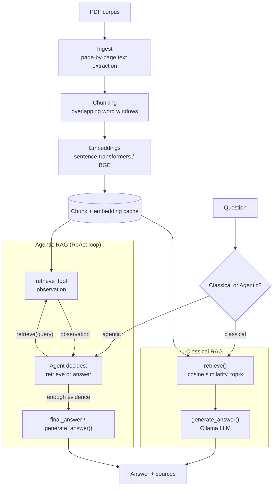

# Rag System

A modular **Retrieval-Augmented Generation** system built from scratch for learning.
Supports both **Classical RAG** and **Agentic RAG** (ReAct loop) so they can be
evaluated and compared.

Given a question, it finds relevant passages from your PDF library and generates
a grounded answer using a local LLM (Ollama).

---

## Architecture



---

## Project Structure

```
Rag System/
├── pdfs/                 # Academic papers (PDF)
├── data/                 # Cache for chunks & embeddings (gitignored)
├── tests/                # Offline automated test suite (smoke tests)
├── examples/             # Manual demo scripts (need live Ollama + real PDFs)
├── src/
│   ├── __init__.py
│   ├── ingest.py         # Load PDFs, extract text page-by-page
│   ├── chunking.py       # Split pages into overlapping word chunks
│   ├── embeddings.py     # Convert chunks to vector embeddings
│   ├── retriever.py      # Find most similar chunks for a query
│   ├── similarity.py     # Manual vector math (dot product, cosine, softmax)
│   ├── generator.py      # Call Ollama LLM to produce answer from context
│   ├── rag.py            # Classical RAG orchestrator
│   └── agent/
│       ├── __init__.py
│       ├── state.py      # Agent working memory (AgentState)
│       ├── tools.py      # Tool wrappers over existing modules
│       └── react_agent.py  # ReAct decision loop (Agentic RAG)
├── requirements.txt
├── .gitignore
└── README.md
```

---

## Classical RAG vs Agentic RAG

### Classical RAG (src/rag.py)

Fixed pipeline: one retrieval pass, then generate.

```
Question
   |
retrieve()
   |
Top-k chunks
   |
generate_answer()
   |
Answer
```

### Agentic RAG (src/agent/)

The agent decides iteratively whether to retrieve more information
or produce a final answer.

```
Question
   |
Agent decides
   |
retrieve(query_1)
   |
Observation
   |
Agent evaluates
   |
retrieve(query_2)  [if needed]
   |
Observation
   |
Agent evaluates
   |
final_answer / generate_answer()
   |
Answer
```

---

## Setup

### 1. Install dependencies

```bash
python -m venv .venv
.\.venv\Scripts\activate
pip install -r requirements.txt
```

### 2. Install and run Ollama

```bash
ollama pull qwen2.5:3b
ollama serve
```

### 3. Add PDFs

Place PDF files in the pdfs/ directory (or use the included papers).

---

## Usage

### Classical RAG

```bash
python -m src.rag "What is the transformer architecture?"
python -m src.rag "How does dropout work?" --top-k 3 --json
```

```python
from src.rag import run_rag_pipeline
result = run_rag_pipeline("What is attention?", top_k=5)
print(result.answer)
for s in result.sources:
    print(f"  - {s['source']}, p. {s['page']}")
```

### Agentic RAG

```bash
python -m examples.demo_agentic "Why is multi-head attention useful?" --source-filter "Attention Is All You Need"
```

```python
from src.ingest import load_pdfs
from src.chunking import chunk_pages
from src.embeddings import load_embedding_model, embed_chunks
from src.agent.react_agent import run_agent

pages = load_pdfs("pdfs")
filtered = [p for p in pages if "Attention Is All You Need" in p.source]
chunks = chunk_pages(filtered, chunk_size=500, overlap=100)
model = load_embedding_model()
embedded = embed_chunks(chunks, model)

state = run_agent(
    question="Why is multi-head attention useful?",
    embedded_chunks=embedded,
    model=model,
    max_steps=5,
    top_k=3,
)

print(f"Steps: {state.step}")
print(f"Queries: {state.queries}")
print(f"Answer: {state.final_answer}")
```

---

## Modules Overview

| Module | Purpose | Key Concept |
|--------|---------|-------------|
| ingest.py | Extract text from PDF files page-by-page | pymupdf library |
| chunking.py | Split pages into overlapping word windows | chunk_size, overlap |
| embeddings.py | Convert text chunks to numerical vectors | sentence-transformers, BGE |
| retriever.py | Find top-k most similar chunks for a query | cosine similarity, ranking |
| similarity.py | Manual implementations of vector math | dot product, norm, softmax |
| generator.py | Call Ollama LLM with context to answer | prompt engineering, grounding |
| rag.py | Classical RAG orchestration | pipeline, caching |
| agent/state.py | Agent working memory | AgentState, AgentObservation |
| agent/tools.py | Tool wrappers for the agent | retrieve_tool |
| agent/react_agent.py | Agentic ReAct decision loop | iterative retrieval, tool calls |

---

## Configuration

| Parameter | Default | Description |
|-----------|---------|-------------|
| chunk_size | 500 | Words per chunk |
| overlap | 100 | Overlapping words between chunks |
| top_k | 5 | Number of chunks to retrieve per call |
| embedding_model | BAAI/bge-small-en-v1.5 | Model for text embeddings |
| ollama_model | qwen2.5:3b | LLM for answer generation |
| temperature | 0.1 | LLM randomness (lower = more factual) |
| max_steps (agent) | 5 | Maximum retrieval steps in agent loop |

---

## Architecture Principles

- **Classical RAG** (rag.py) remains the baseline and is unchanged.
- **Agentic RAG** (agent/) is a separate package that reuses existing modules.
- Both share the same document corpus, embedding model, and generator.
- No LangChain, LangGraph, or external agent frameworks.
- Everything is implemented manually for learning.

---

## Tests

- **Smoke** (`pytest -m smoke`, or `python scripts/smoke.py` from the repo root): does the pipeline run? Chunking, retrieval (against a 5-document synthetic fixture corpus, `tests/fixtures/corpus/`, with a deterministic hashing embedder), and the full pipeline end-to-end with a scripted generator (`tests/conftest.py`). No network access, no model downloads, no Ollama server.
- **Unit**: covered by the same smoke-marked tests above -- this project's test layer doesn't currently separate the two tiers further.
- **Eval** (not in CI, needs a local Ollama server and the real PDF corpus): retrieval/generation quality -- see "RAG Evaluation" below, and the manual demo scripts in [`examples/`](./examples/).

```bash
pytest -m smoke   # same as the full suite here, but explicit
pytest             # the full suite
```

---

## RAG Evaluation — Four-Way Benchmark

All four RAG variants were evaluated on the same deterministic subset of
**Open RAGBench** (``pdf/arxiv``, text-only queries) using identical:

* corpus (same embedded chunks, same chunking)
* embedding model (``BAAI/bge-small-en-v1.5``)
* generator (``qwen2.5:3b`` via Ollama)
* evaluation queries and seed (``seed=42``)
* retrieval metric computation

**Important limitation:** The measurements below used a **100-document corpus**
(gold documents + deterministic distractors) rather than the full 1,000-document
corpus, because embedding the full corpus takes 80+ minutes on CPU.  The same
corpus was used for ALL systems, so the comparison is internally fair.  The full
corpus run is available via:

```powershell
python -m benchmark.evaluate_rag --system all --corpus-docs 0 --limit 100 --seed 42 --eval-generation
```

---

### Variants

| Label | Retrieval | Description |
|---|---|---|
| **A. Naive** | Dense vector only | Fixed-size chunking, cosine similarity, dense top-k |
| **B. Hybrid** | Dense + BM25 (RRF) | Dense + Okapi BM25 fused with Reciprocal Rank Fusion (k=60) |
| **C. Hybrid + Reranker** | Hybrid + Cross-Encoder | Hybrid retrieval (candidate_k=50) -> cross-encoder rerank -> top-5 |
| **D. Agentic** | Dense (ReAct loop) | Agent decides when/how to retrieve; max 5 steps; uses dense retrieval (reported explicitly) |

---

> **Note on section vs page:** During benchmark evaluation the chunk ``page`` field stores the
> Open RAGBench ``section_id`` (not a physical PDF page number).  Document-level retrieval matches
> ``source == gold_doc_id``; section-level matches ``(source, page) == (gold_doc_id, gold_section_id)``.

---

### Measured Results (5 text-only queries, 100-doc corpus, seed=42)

The 1.0 Hit@5 values reflect the small corpus (100 docs) — retrieval is easy.
The real value of this comparison is in the efficiency trade-offs.

| System | Hit@5 | MRR | Avg Latency | Avg Input Tokens | Avg Output Tokens | Avg Ret Calls | Avg Steps |
|---|---:|---:|---:|---:|---:|---:|---:|
| A. Naive Dense | 1.00 | 1.00 | 6.4 s | 2,925 | 147 | 1.00 | — |
| B. Hybrid Search | 1.00 | 1.00 | 3.8 s | 2,751 | 105 | 1.00 | — |
| C. Hybrid + Reranker | 1.00* | 1.00* | ~37 s* | 3,175* | 156* | 1.00 | — |
| D. Agentic RAG | 1.00 | 1.00 | 8.5 s | N/A** | N/A** | 1.00 | 2.00 |

**Footnotes:**
- ``*`` — Reranker measured on 2 queries (model loading overhead dominates; per-query latency after warmup is lower).
- ``**`` — Agentic token counts were None in the initial smoke run (stale results).  Ollama was
  verified to expose ``prompt_eval_count``/``eval_count``; re-running now captures complete agentic tokens.

---

### Generation Quality (LLM-as-a-Judge, 5 queries, Naive Dense)

| Faithfulness | Answer Correctness | Answer Relevance |
|---|---:|---:|
| 0.80 | 0.80 | 1.00 |

(Judged by ``qwen2.5:3b`` with binary VERDICT labels.  Only run on Naive in this
smoke test; available for all systems via ``--eval-generation``.)

---

### Analysis

**On this small corpus (100 docs), all systems achieve perfect Hit@5** — retrieval
is trivially easy because the gold document is almost always in the top-5 among
only ~100 candidate documents.

**Efficiency observations (from these measured runs):**

| Observation | Detail |
|---|---|
| Hybrid slightly faster than Naive | 3.8s vs 6.4s per query; likely due to LLM serving variance, not retrieval advantage |
| Reranker has significant overhead | Cross-encoder model loading and inference adds 30+ seconds per query on CPU |
| Agentic uses 2 steps consistently | All 5 queries were answered in 1 retrieval + 1 final_answer, no multi-step retrieval needed |
| Agentic latency is moderate | 8.5s vs Naive 6.4s; the ReAct planning LLM call adds ~2s overhead |

**What the full benchmark (1000 docs, 100 queries) would expose:**

* **Retrieval quality differences** — on the full corpus, dense-only retrieval
  may fail to find gold documents that BM25 can catch, and reranking should
  improve precision.
* **Multi-step agent behaviour** — with harder questions, the agent may need
  multiple retrievals, increasing latency and tokens.
* **Hallucination on unanswerable questions** — the unanswerable query set
  (``benchmark/unanswerable_queries.json``, 25 questions) is ready for evaluation
  via ``--eval-unanswerable`` but was not run in this smoke test.

---

### Failure Analysis (Qualitative)

**Classical vs Agentic (5 queries):** Both systems found gold documents for all
5 queries.  No retrieval failures to analyze on this small corpus.

**Unanswerable behaviour:** Not yet evaluated.  The unanswerable query set is
ready.  A correct abstention looks like: *The provided documents do not contain
enough information to answer this question.*  The hallucination rate metric will
quantify how often each system instead produces unsupported factual content.

---

### Reproducibility

**Benchmark:** Open RAGBench ``pdf/arxiv``, text-only subset (1,914 queries total)

**Command used for the smoke test (this README):**

```powershell
# Run individual systems (5 queries each):
python -m benchmark.evaluate_rag --system naive   --limit 5 --seed 42
python -m benchmark.evaluate_rag --system hybrid  --limit 5 --seed 42
python -m benchmark.evaluate_rag --system agentic --limit 5 --seed 42
```

**Pre-flight checks (recommended before the full run):**

```powershell
python -m benchmark.evaluate_rag --preflight
```

**One-time corpus preparation (builds + caches the full 1000-doc embeddings):**

```powershell
python -m benchmark.evaluate_rag --prepare-corpus --corpus-docs 0
```

**Command for the full benchmark (not yet executed):**

```powershell
python -m benchmark.evaluate_rag `
    --system all `
    --corpus-docs 0 `
    --limit 100 `
    --seed 42 `
    --eval-generation `
    --eval-unanswerable
```

**Latency methodology:** Per-query latency uses ``time.perf_counter()`` and is measured
only after all models/indexes are loaded and warmed up (unmeasured).  Startup time
(corpus embedding, BM25 build, reranker load) is recorded separately as
``startup_time_seconds``.  Mean, median (p50) and p95 latency are reported.

**Settings:**

| Setting | Value |
|---|---|
| Benchmark | Open RAGBench pdf/arxiv (text-only) |
| Subset size | 5 queries (smoke) / 100 queries (full) |
| Seed | 42 |
| Corpus size | 100 docs (smoke) / 1000 docs (full) |
| Chunk size | 500 words |
| Overlap | 100 words |
| Embedding model | BAAI/bge-small-en-v1.5 |
| Generator model | qwen2.5:3b (Ollama) |
| Top-k (final) | 5 |
| BM25 parameters | k1=1.5, b=0.75 |
| RRF constant | k=60 |
| Candidate-k (hybrid) | 50 |
| Reranker model | cross-encoder/ms-marco-MiniLM-L-6-v2 |
| Candidate-k (reranker) | 50 -> rerank -> 5 |
| Agent MAX_STEPS | 5 |
| Agent retrieval | Dense only (reported explicitly) |

---

### Production Recommendation

Based on this smoke test (limited corpus), no definitive recommendation can be
made — retrieval quality differences only emerge on larger corpora.  However,
the **latency numbers already show** that:

* **Hybrid Search (B) adds negligible overhead** over Naive (3.8s vs 6.4s) while
  providing a second retrieval signal that should improve recall on the full corpus.
* **Reranker (C) has significant latency cost** (~37s on CPU).  It should be
  evaluated against the expected retrieval quality gain on the full benchmark.
* **Agentic (D) adds moderate overhead** (~2s for planning) without changing
  retrieval quality on this easy subset.

**Anticipated outcome on the full benchmark:**

If Hybrid + Reranker achieves the best retrieval quality, I would deploy it for
high-value, latency-tolerant use cases (e.g., research search).  If the latency
is unacceptable, Hybrid alone provides most of the benefit at lower cost.

Agentic RAG becomes valuable when:
- questions are multi-hop or ambiguous
- targeted re-retrieval with reformulated queries helps
- the user wants the system to decide whether it needs more evidence

For simple factual lookup on a well-indexed corpus, Naive or Hybrid is sufficient.

---

### Implementation Details

**Hybrid Search** — Self-contained Okapi BM25 implementation (``benchmark/bm25.py``,
no external dependency).  Dense and BM25 retrieval run in parallel, fused with
standard RRF (k=60, not tuned on eval set).  Both use identical chunks.

**Reranker** — ``sentence_transformers.CrossEncoder`` with
``cross-encoder/ms-marco-MiniLM-L-6-v2`` (small, local, English).  Operates only
on the hybrid candidate set (50 candidates), never on the full corpus.

**Agentic RAG** — Existing Stage 1 ReAct loop (``src/agent/react_agent.py``),
unchanged.  Uses ``retrieve`` (dense) as its retrieval tool.  Explicitly reported
so the architectural contribution (agent loop) is separated from the retrieval
contribution (dense vs hybrid).

**Token usage** — Captured from Ollama ``prompt_eval_count`` / ``eval_count``
fields where available.  Added to ``GenerationResult`` and ``AgentState`` as
backward-compatible optional fields.

**Unanswerable queries** — 25 manually crafted questions
(``benchmark/unanswerable_queries.json``).  All ask about topics absent from the
corpus (papers not indexed, undisclosed hyperparameters).  LLM-as-a-Judge for
abstention detection via binary ``VERDICT: abstained / answered``.
