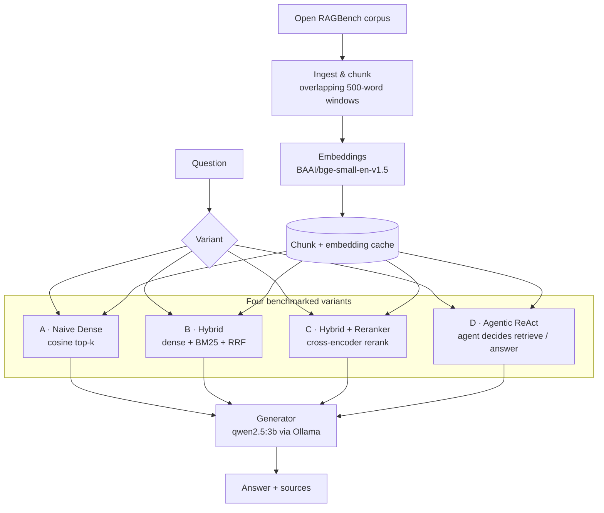

# Rag System

A modular local Retrieval-Augmented Generation system implementing and benchmarking
dense retrieval, hybrid BM25+dense retrieval, cross-encoder reranking, and a
ReAct-style agentic retrieval loop.

All inference runs locally through Ollama — no LangChain, LangGraph, or external
agent frameworks. Every retrieval, fusion, reranking, and agent component is
implemented manually. The four variants share the same corpus, embedding model, and
generator so they can be compared under controlled conditions, and are evaluated on
Open RAGBench.

This is a learning/portfolio project, not a production-ready system.

---

## Architecture



Variants A–C are fixed single-pass pipelines that differ only in retrieval.
Variant D wraps a ReAct loop around dense retrieval (its retrieval tool).

---

## Project Structure

```
rag-system/
├── pdfs/                 # Academic papers (PDF) for manual demos
├── data/                 # Cache for chunks & embeddings (gitignored)
├── tests/                # Offline automated test suite (regression tests)
├── examples/             # Manual demo scripts (need live Ollama + real PDFs)
├── benchmark/            # Four-way RAG benchmark + evaluation
│   ├── evaluate_rag.py   # CLI: run systems, judge, summarize
│   ├── metrics.py        # Hit@k / MRR (document + section levels)
│   ├── bm25.py           # Sparse-postings Okapi BM25
│   ├── hybrid.py         # Dense + BM25 RRF fusion
│   ├── reranker.py       # Cross-encoder reranking
│   ├── evaluators.py     # Per-system run wrappers
│   ├── generation_metrics.py  # LLM-as-a-judge (faithfulness etc.)
│   ├── open_ragbench_loader.py # Open RAGBench corpus/query loader
│   ├── unanswerable_queries.json
│   ├── results/          # JSONL results + summary.json (do not edit)
│   └── open_ragbench/    # Local pdf/arxiv dataset
├── src/
│   ├── ingest.py         # Load PDFs, extract text page-by-page
│   ├── chunking.py       # Split pages into overlapping word chunks
│   ├── embeddings.py     # Convert chunks to vector embeddings
│   ├── retriever.py      # Find top-k most similar chunks for a query
│   ├── similarity.py     # Manual vector math (dot product, cosine, softmax)
│   ├── generator.py      # Call Ollama LLM to produce answer from context
│   ├── rag.py            # Classical RAG orchestrator
│   └── agent/
│       ├── state.py      # Agent working memory (AgentState)
│       ├── tools.py      # Tool wrappers over existing modules
│       └── react_agent.py  # ReAct decision loop (Agentic RAG)
├── requirements.txt
├── .gitignore
└── README.md
```

---

## Setup

### 1. Install dependencies

```bash
python -m venv .venv
.\.venv\Scripts\activate
pip install -r requirements.txt
```

### 2. Install and run Ollama

```bash
ollama pull qwen2.5:3b
ollama serve
```

### 3. Add PDFs

Place PDF files in the pdfs/ directory (or use the included papers).

---

## Usage

### Classical RAG

```bash
python -m src.rag "What is the transformer architecture?"
python -m src.rag "How does dropout work?" --top-k 3 --json
```

```python
from src.rag import run_rag_pipeline
result = run_rag_pipeline("What is attention?", top_k=5)
print(result.answer)
for s in result.sources:
    print(f"  - {s['source']}, p. {s['page']}")
```

### Agentic RAG

```bash
python -m examples.demo_agentic "Why is multi-head attention useful?" --source-filter "Attention Is All You Need"
```

```python
from src.ingest import load_pdfs
from src.chunking import chunk_pages
from src.embeddings import load_embedding_model, embed_chunks
from src.agent.react_agent import run_agent

pages = load_pdfs("pdfs")
filtered = [p for p in pages if "Attention Is All You Need" in p.source]
chunks = chunk_pages(filtered, chunk_size=500, overlap=100)
model = load_embedding_model()
embedded = embed_chunks(chunks, model)

state = run_agent(
    question="Why is multi-head attention useful?",
    embedded_chunks=embedded,
    model=model,
    max_steps=5,
    top_k=3,
)

print(f"Steps: {state.step}")
print(f"Queries: {state.queries}")
print(f"Answer: {state.final_answer}")
```

---

## Modules Overview

| Module | Purpose | Key Concept |
|--------|---------|-------------|
| ingest.py | Extract text from PDF files page-by-page | pymupdf library |
| chunking.py | Split pages into overlapping word windows | chunk_size, overlap |
| embeddings.py | Convert text chunks to numerical vectors | sentence-transformers, BGE |
| retriever.py | Find top-k most similar chunks for a query | cosine similarity, ranking |
| similarity.py | Manual implementations of vector math | dot product, norm, softmax |
| generator.py | Call Ollama LLM with context to answer | prompt engineering, grounding |
| rag.py | Classical RAG orchestration | pipeline, caching |
| agent/state.py | Agent working memory | AgentState, AgentObservation |
| agent/tools.py | Tool wrappers for the agent | retrieve_tool |
| agent/react_agent.py | Agentic ReAct decision loop | iterative retrieval, tool calls |

---

## Configuration

| Parameter | Default | Description |
|-----------|---------|-------------|
| chunk_size | 500 | Words per chunk |
| overlap | 100 | Overlapping words between chunks |
| top_k | 5 | Number of chunks to retrieve per call |
| embedding_model | BAAI/bge-small-en-v1.5 | Model for text embeddings |
| ollama_model | qwen2.5:3b | LLM for answer generation |
| temperature | 0.1 | LLM randomness (lower = more factual) |
| max_steps (agent) | 5 | Maximum retrieval steps in agent loop |

---

## Architecture Principles

- Four retrieval variants share the same document corpus, embedding model, and generator so the comparison is controlled.
- Hybrid and reranking components reuse the same chunks and embedding cache as Naive.
- The agentic loop reuses existing retrieval modules; no external agent framework.
- Everything is implemented manually for learning.

---

## Tests

The test suite runs fully offline — no network, no model downloads, no Ollama server.
It uses synthetic fixture corpora, a deterministic hashing embedder, and scripted
generators.

```bash
python -m pytest tests/ -v
```

Benchmark-facing code paths (summary rebuild, unanswerable adapter, output
isolation) are covered by regression tests that write to isolated temp directories
so they cannot overwrite real results.

---

## Benchmark

### Setup

The four variants were evaluated on the same deterministic subset of
**Open RAGBench** (`pdf/arxiv`, text-only queries).

| Setting | Value |
|---|---|
| Benchmark | Open RAGBench pdf/arxiv (text-only) |
| Eligible text queries | 1,914 in the source dataset |
| Evaluation subset | 100 queries (deterministic, seed 42) |
| Corpus | full 1,000 documents (37,846 embedded chunks) |
| Chunk size / overlap | 500 / 100 words |
| Embedding model | BAAI/bge-small-en-v1.5 |
| Generator | qwen2.5:3b via Ollama |
| Top-k (final) | 5 |
| BM25 | k1=1.5, b=0.75 |
| RRF | k=60 |
| Hybrid candidate pool | 50 |
| Reranker | cross-encoder/ms-marco-MiniLM-L-6-v2 |
| Agent MAX_STEPS | 5 (retrieval tool = dense) |

**Section-level evaluation:** The benchmark `section_id` is stored in each chunk's
`page` field. Document-level retrieval matches `source == gold_doc_id`; section-level
matches `(source, page) == (gold_doc_id, gold_section_id)`. Both granularities are
reported.

### Variants

| Label | Retrieval | Description |
|---|---|---|
| A. Naive Dense | Dense vector only | Cosine similarity, dense top-k |
| B. Hybrid | Dense + BM25 (RRF) | Okapi BM25 fused with Reciprocal Rank Fusion (k=60) |
| C. Hybrid + Reranker | Hybrid + Cross-Encoder | 50 candidates -> cross-encoder rerank -> top-5 |
| D. Agentic ReAct | Dense (ReAct loop) | Agent decides retrieve/answer; max 5 steps; dense retrieval tool |

---

### Full-Corpus Benchmark Results

100 queries · 1,000 documents · seed 42

| System | Doc Hit@1 | Doc Hit@5 | Doc MRR | Section Hit@1 | Section Hit@5 | Section MRR | Avg Latency | p95 Latency |
|---|---:|---:|---:|---:|---:|---:|---:|---:|
| A. Naive Dense | 0.91 | 0.98 | 0.937 | 0.61 | 0.93 | 0.741 | 5.29 s | 9.04 s |
| B. Hybrid | 0.96 | 1.00 (ceiling, n=100) | 0.976 (near-ceiling, n=100) | 0.69 | 0.97 | 0.805 | 5.41 s | 9.35 s |
| C. Hybrid + Reranker | 0.99 | 1.00 (ceiling, n=100) | 0.993 (near-ceiling, n=100) | 0.81 | 0.96 | 0.879 | 8.87 s | 12.54 s |
| D. Agentic ReAct | 0.82 | 0.93 | 0.860 | 0.46 | 0.81 | 0.598 | 8.44 s | 13.18 s |

Doc Hit@5 and Doc MRR are at or near their ceiling for three of four systems and no
longer discriminate between them at this n; Doc Hit@1 and the section-level columns
are the more informative comparison here.

Latency is per-query wall time measured with `time.perf_counter()` after models and
indexes are loaded and warmed; startup time (corpus embedding, BM25 build, reranker
load) is recorded separately. Mean and p95 are reported. **The execution environment
(CPU/GPU, OS, Ollama version) was not logged for this run and is not recorded
anywhere in this repository** — whether all four systems ran under identical hardware
conditions cannot be confirmed from the artifacts, so treat the latency comparisons
in this section with that gap in mind.

### Efficiency / Token Usage

| System | Avg Input Tokens | Avg Output Tokens | Avg Total Tokens |
|---|---:|---:|---:|
| A. Naive Dense | 2,702 | 186 | 2,888 |
| B. Hybrid | 2,767 | 188 | 2,955 |
| C. Hybrid + Reranker | 2,750 | 198 | 2,948 |
| D. Agentic ReAct | 3,891 | 218 | 4,110 |

Hybrid improves retrieval substantially over Naive while adding only small latency
and token overhead. Reranking achieves the strongest retrieval quality but increases
latency. Agentic consumes substantially more tokens and latency while producing weaker
retrieval in this benchmark.

### Agentic Diagnostics

Measured on the 100 answerable queries:

| Metric | Value |
|---|---|
| Avg steps | 2.0 |
| Avg retrieval calls | 1.0 |
| Queries with >1 retrieval | 0% |
| Gold found on retrieval call 1 | 93/100 |
| Gold never found | 7/100 |

Under this benchmark configuration and local 3B model, the ReAct agent did not use
iterative multi-retrieval. In practice it behaved as: question -> LLM retrieval-query
decision/rewrite -> one dense retrieval -> final answer. The agentic orchestration
added planning/token cost without a multi-step retrieval advantage under this tested
policy/model.

> `termination_reason` was unavailable for the older 100-query answerable run (the
> field postdates those records), so no termination breakdown is reported for it.

### Unanswerable / Hallucination Test

A targeted abstention test: 25 deliberately unanswerable questions per system (topics
absent from the corpus). All 25 abstention verdicts were successfully parsed for all
four systems.

All rates below are computed on n=25 per system — a small, targeted test, not proof
of general hallucination safety.

| System | Abstained | Hallucinated | Abstention Rate (n=25) | Hallucination Rate (n=25) |
|---|---:|---:|---:|---:|
| A. Naive Dense | 23/25 | 2/25 | 0.92 | 0.08 |
| B. Hybrid | 23/25 | 2/25 | 0.92 | 0.08 |
| C. Hybrid + Reranker | 25/25 | 0/25 | 1.00 (ceiling, n=25) | 0.00 (n=25) |
| D. Agentic ReAct | 25/25 | 0/25 | 1.00 (ceiling, n=25) | 0.00 (n=25) |

For the Agentic unanswerable run: avg steps = 2.0, avg retrieval calls = 1.0,
`termination_reason = final_answer` for all 25 queries.

### Generation Quality (LLM-as-a-Judge) — Secondary

| System | Faithfulness | Coverage | Correctness | Relevance |
|---|---:|---:|---:|---:|
| A. Naive Dense | 0.590 | 78/100 | 0.74 | 0.91 |
| B. Hybrid | 0.623 | 77/100 | 0.73 | 0.89 |
| C. Hybrid + Reranker | 0.688 | 77/100 | 0.66 | 0.85 |
| D. Agentic ReAct | 0.615 | 78/100 | 0.73 | 0.83 |

**The judge is `qwen2.5:3b` — the same model that generated the answers being
judged.** This is self-grading, not an independent evaluator; scores in this table
should be read with that conflict of interest in mind. Faithfulness parse coverage
was only 77–78/100, and scores are calculated over successfully parsed verdicts.
These metrics are therefore secondary and should not be interpreted as ground-truth
human evaluation.

### Results Interpretation

1. **Hybrid is the best efficiency/quality trade-off.** Compared with Naive, Doc
   Hit@1 rose 0.91 -> 0.96 and Section Hit@1 rose 0.61 -> 0.69, while average latency
   increased only 5.29 s -> 5.41 s. This is strong evidence that lexical BM25 + dense
   RRF adds useful retrieval signal at little incremental runtime cost in this setup.

2. **Reranker gives the strongest retrieval.** Doc Hit@1 = 0.99, Section Hit@1 = 0.81,
   Section MRR = 0.879 — the best of all variants — but at 8.87 s average latency.
   This is a quality/latency trade-off.

3. **Agentic orchestration did not improve this benchmark.** Doc Hit@1 = 0.82,
   Section Hit@1 = 0.46, average latency 8.44 s, ~4,110 tokens, and 0/100 queries used
   more than one retrieval. Under the tested ReAct policy and qwen2.5:3b model, agentic
   orchestration added planning/token cost without improving retrieval. This does not
   generalize beyond this experiment.

4. **Abstention benefited from Reranker and Agentic** in this targeted test (25/25 vs
   23/25 for Naive/Hybrid), though n=25 is too small to draw strong conclusions.

---

## Engineering Notes

- The full corpus is 37,846 chunks; an on-disk embedding cache avoids repeated
  full-corpus embedding across runs and systems.
- The custom BM25 uses sparse postings rather than a dense vocabulary x document
  matrix, allowing the full corpus to fit in memory.
- Full benchmark code paths (summary rebuild, unanswerable adapter) have regression
  tests; benchmark tests isolate output paths so they cannot overwrite real results.
- Malformed ReAct decisions trigger bounded retries, preventing a single bad parse
  from failing an entire run.
- The benchmark summary can be rebuilt deterministically from existing JSONLs without
  rerunning inference (`--summarize-existing`).

---

## Reproducibility

Full benchmark (all four systems, generation judging, unanswerable evaluation):

```powershell
python -m benchmark.evaluate_rag `
    --system all `
    --corpus-docs 0 `
    --limit 100 `
    --seed 42 `
    --eval-generation `
    --eval-unanswerable
```

The original run was interrupted before the unanswerable stage, which was later
completed independently. To run only the unanswerable stage safely without
re-touching the answerable JSONLs:

```powershell
python -m benchmark.evaluate_rag `
    --system all `
    --corpus-docs 0 `
    --unanswerable-only
```

Rebuild the coverage-aware `summary.json` from existing JSONLs (no models,
retrieval, generation, or judging):

```powershell
python -m benchmark.evaluate_rag --summarize-existing
```

Pre-flight checks (validate environment before a full run):

```powershell
python -m benchmark.evaluate_rag --preflight
```

One-time corpus preparation (builds and caches the full 1,000-doc embeddings):

```powershell
python -m benchmark.evaluate_rag --prepare-corpus --corpus-docs 0
```

---

## Production Recommendation

For this workload, Hybrid Dense + BM25/RRF offers the strongest quality/latency
trade-off. Hybrid + Reranker is preferable when retrieval precision matters more than
latency. The tested Agentic configuration is not justified for simple factual
retrieval because it added cost without triggering multi-step retrieval.

These conclusions are specific to this benchmark configuration and local 3B model;
they do not generalize to all RAG workloads.

---

## Implementation Details

**Hybrid Search** — Self-contained Okapi BM25 implementation (`benchmark/bm25.py`,
no external dependency). Dense and BM25 retrieval run in parallel, fused with
standard RRF (k=60, not tuned on the eval set). Both use identical chunks.

**Reranker** — `sentence_transformers.CrossEncoder` with
`cross-encoder/ms-marco-MiniLM-L-6-v2` (small, local, English). Operates only on the
hybrid candidate set (50 candidates), never on the full corpus.

**Agentic RAG** — ReAct loop (`src/agent/react_agent.py`) using `retrieve` (dense) as
its retrieval tool, so the architectural contribution (agent loop) is separated from
the retrieval contribution (dense vs hybrid).

**Token usage** — Captured from Ollama `prompt_eval_count` / `eval_count` fields
where available. Added to `GenerationResult` and `AgentState` as
backward-compatible optional fields.

**Unanswerable queries** — 25 manually crafted questions
(`benchmark/unanswerable_queries.json`) asking about topics absent from the corpus.
LLM-as-a-Judge for abstention detection via binary `VERDICT: abstained / answered`.
